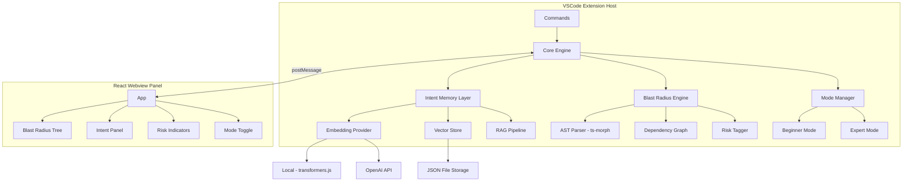
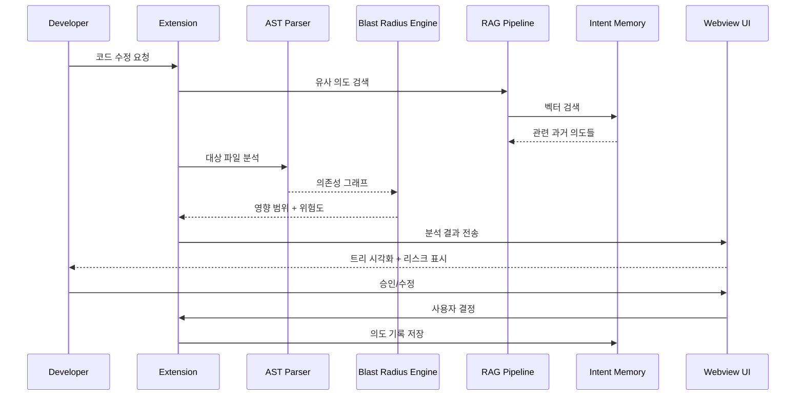

# MARS: Memory-Augmented Retrieval & Refactoring System 구현 계획

## 전체 아키텍처




## 디렉토리 구조

```
mars-vscode/
├── package.json                    # Extension manifest + 의존성
├── tsconfig.json                   # TypeScript 설정
├── esbuild.config.mjs              # 빌드 설정
├── src/
│   ├── extension.ts                # 확장 진입점
│   ├── commands/
│   │   ├── analyzeBlastRadius.ts   # 영향 범위 분석 명령
│   │   ├── recordIntent.ts         # 의도 기록 명령
│   │   └── searchIntents.ts        # 과거 의도 검색 명령
│   ├── providers/
│   │   ├── sidebarProvider.ts      # Webview 사이드바 제공자
│   │   └── blastRadiusTreeProvider.ts # 트리뷰 제공자
│   ├── core/
│   │   ├── memory/
│   │   │   ├── intentStore.ts      # Intent CRUD + 메타데이터 관리
│   │   │   ├── vectorStore.ts      # 벡터 저장/검색 (cosine similarity)
│   │   │   ├── embeddingProvider.ts # 임베딩 추상화 (local/OpenAI)
│   │   │   └── ragPipeline.ts      # RAG 검색 + 컨텍스트 생성
│   │   ├── analysis/
│   │   │   ├── astParser.ts        # ts-morph 기반 AST 분석
│   │   │   ├── dependencyGraph.ts  # 의존성 그래프 구축
│   │   │   ├── blastRadiusEngine.ts# 영향 반경 계산
│   │   │   └── riskTagger.ts       # 위험 태그 자동 분류
│   │   └── modes/
│   │       ├── modeManager.ts      # 모드 전환 관리
│   │       ├── beginnerMode.ts     # 자동 제안 모드
│   │       └── expertMode.ts       # 수동 승인 모드
│   ├── models/
│   │   ├── intent.ts               # IntentRecord, ModificationScope 등
│   │   ├── blastRadius.ts          # BlastRadiusResult, ImpactedFile 등
│   │   └── riskTag.ts              # RiskTag enum, 위험 카테고리
│   └── utils/
│       ├── config.ts               # 설정 관리
│       └── logger.ts               # 로깅 유틸리티
├── webview-ui/                     # React 웹뷰 (별도 빌드)
│   ├── package.json
│   ├── tsconfig.json
│   ├── vite.config.ts
│   ├── index.html
│   └── src/
│       ├── main.tsx
│       ├── App.tsx
│       ├── vscode.ts               # VSCode API 브릿지
│       ├── components/
│       │   ├── BlastRadiusTree.tsx  # 영향 범위 트리 (색상 코딩)
│       │   ├── IntentPanel.tsx      # 의도 기록/검색 패널
│       │   ├── IntentHistory.tsx    # 과거 의도 타임라인
│       │   ├── RiskBadge.tsx        # 위험 태그 뱃지
│       │   ├── ModeSwitch.tsx       # Beginner/Expert 토글
│       │   ├── DiffPreview.tsx      # 수정 미리보기
│       │   └── Header.tsx           # 헤더 + 상태 표시
│       ├── hooks/
│       │   ├── useVSCodeMessage.ts  # 메시지 통신 훅
│       │   └── useBlastRadius.ts    # 분석 결과 관리 훅
│       └── styles/
│           └── globals.css          # VSCode 테마 호환 스타일
└── test/
    ├── analysis.test.ts
    └── memory.test.ts
```

## 핵심 데이터 모델

### IntentRecord (의도 기록)

```typescript
interface IntentRecord {
  id: string;
  timestamp: number;
  description: string;           // 수정 의도 설명
  scope: {
    files: string[];             // 대상 파일 경로
    symbols: string[];           // 대상 함수/클래스명
    ranges: Range[];             // 코드 범위
  };
  riskTags: RiskTag[];           // auth, db, validation, api, state
  dependencySnapshot: string[];  // 수정 시점 의존성 목록
  mode: 'beginner' | 'expert';
  status: 'pending' | 'approved' | 'applied' | 'reverted';
  embedding: number[];           // 벡터 임베딩
  blastRadius?: BlastRadiusResult;
}
```

### BlastRadiusResult (영향 범위)

```typescript
interface BlastRadiusResult {
  targetFile: string;
  targetSymbol: string;
  impactedFiles: {
    path: string;
    symbols: string[];
    riskLevel: 'low' | 'medium' | 'high' | 'critical';
    distance: number;            // 호출 체인 거리
  }[];
  totalRiskScore: number;        // 0-100
  riskTags: RiskTag[];
  dependencyChain: { from: string; to: string; type: string }[];
}
```

## 기술 스택


| 구성요소       | 기술                           | 이유                            |
| ---------- | ---------------------------- | ----------------------------- |
| Extension  | TypeScript + esbuild         | VSCode 공식 권장                  |
| AST 분석     | ts-morph                     | 순수 JS, 풍부한 TypeScript AST API |
| 로컬 임베딩     | @xenova/transformers         | ONNX 기반, 네이티브 의존 없음           |
| OpenAI 임베딩 | openai SDK                   | 고품질 벡터, 선택적 사용                |
| 벡터 저장      | JSON + cosine similarity     | 경량, 이식성, 네이티브 빌드 불필요          |
| Webview UI | React + Vite                 | 컴포넌트 기반, 빠른 HMR               |
| 스타일링       | CSS Variables (VSCode 테마 연동) | 다크/라이트 모드 자동 호환               |


## 데이터 흐름




## 구현 단계 (8단계)

### Phase 1: 프로젝트 스캐폴딩

- VSCode extension 프로젝트 초기화 (package.json, tsconfig.json, esbuild)
- React webview-ui 프로젝트 초기화 (Vite + React + TypeScript)
- 빌드 파이프라인 구축 (extension + webview 동시 빌드)

### Phase 2: 핵심 데이터 모델

- `IntentRecord`, `BlastRadiusResult`, `RiskTag` 타입 정의
- 모델 간 관계 설정

### Phase 3: AST 분석 + Blast Radius Engine

- ts-morph 기반 AST 파서 구현 (함수, 클래스, import/export 추적)
- 의존성 그래프 빌더 구현 (파일 간 참조 관계)
- 영향 반경 계산기 구현 (BFS/DFS로 호출 체인 추적)
- 위험 태그 자동 분류기 구현 (경로 패턴 + 키워드 기반)

### Phase 4: Intent Memory + Vector Store

- JSON 기반 벡터 저장소 구현 (cosine similarity 검색)
- 임베딩 제공자 추상화 (로컬 transformers.js / OpenAI 전환)
- Intent CRUD 저장소 구현
- RAG 파이프라인 구현 (검색 -> 컨텍스트 조립)

### Phase 5: React Webview UI

- Blast Radius 트리 컴포넌트 (색상 코딩: green/yellow/orange/red)
- Intent 기록/검색 패널
- 위험도 뱃지 + 모드 토글
- VSCode 테마 연동 스타일링

### Phase 6: Mode Manager (Beginner/Expert)

- Beginner 모드: 자동 분석 + 자동 제안
- Expert 모드: 수동 범위 조정 + 승인 워크플로우
- 모드별 UI 분기

### Phase 7: VSCode 통합

- 커맨드 등록 (분석, 기록, 검색)
- 사이드바 패널 등록
- 에디터 데코레이션 (인라인 리스크 표시)
- 상태바 아이템 (현재 모드 표시)

### Phase 8: 테스트 + 마무리

- 핵심 로직 단위 테스트
- README.md 업데이트 (사용법, 스크린샷 가이드)
- .vscodeignore 설정

